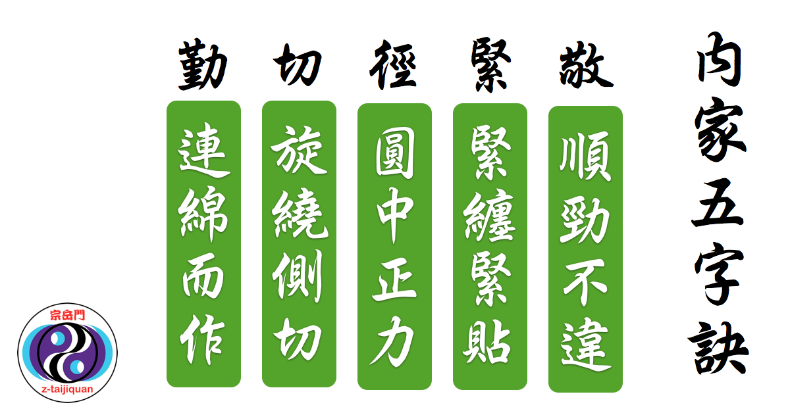

# 纏法和內家五字訣

正氣道館館長
彭啟豪

太極拳的本質，其實就是纏法，經由指尖帶領全身做螺旋性運動。其中又依螺旋的模式，分為大小、正反、上下、左右、進退等纏法。

自古內家訓練，皆由大纏練到小纏，依靠肘挒採的順序，將螺旋越練越小，最後練到指尖。

纏法的作用，在於運用螺旋性的掌法，完成接手走化、改變方向、避實就虛、拆點黏敷。

而纏法所需具備的要點，為內家五字訣「敬、緊、徑、切、勤」，也就是「順勁不違、緊纏緊貼、圓中正力、旋繞側切、連綿而作」。

敬

首要是順勁不違，太極拳人人皆知要順應對方，使用的其實就是纏法。因為纏法是螺旋性運動，所以可以依據對方力量之大小和方向，順勢合應相對的向量。

即拳論：「左重則左虛，右重則右杳，仰之則彌高，俯之則彌深，進之則愈長，退之則愈促」。就是使用各種大小、正反、左右、上下、進退等纏法。

緊

第二是緊纏緊貼，所謂的緊即是綿密的沾黏感，貼身感，打人如親嘴之感。我們順勁接手之後，接下來就是要維持固定的沾黏感，才能引進落空。

所謂「黏依能跟得靈，方見落空之妙」。要想使用纏法沾黏吞吸的技術，就要緊纏緊貼，不能丟離頂抗。內家拳的技術，在貼身的狀態下可以發揮到最大的效果，所以才會強調「守則見肉分槍，攻則貼竿深入」。

徑

第三是圓中正力，太極拳是外圓內方之拳，於外型無使有凹凸、缺陷、斷續，於內在則要維持「蓄勁如張弓，發勁如放箭」，環中的正力線。

正力需要維持，才不會被外力所擊潰。同時運用正力，以實擊虛，從對方的空隙入侵。

切

第四是旋繞側切，這是強調拆點的方向，必須走螺旋線。所謂打蛇隨棍上，如同蛇纏之法，不斷從對方手的側面纏繞而上，這樣才可「以尖制根」。

勤

最後是連綿而作，即沾黏後的「連隨」，或是拳論所謂：「長拳者，如長江大海，滔滔不絕也。」當我們一但開始啟動之後，就要持續黏敷或擊打對手，以「應手即仆」做為施技的要求。

練功和用技

平日練功的時候，可以分階段練習，先以控制為主。但在用技的時候，則千萬不能在控制之後稍作停留，這樣會讓自己也養成站煞的壞習慣。所以，太極拳為什麼採用不發勁的練習，就是要讓自己的走黏技術，連綿不絕。

引落合出、敷蓋對吞

內家五字訣「敬、緊、徑、切、勤」，是纏法技術的心法，也是太極拳用技的SOP。順勁不違接手、緊纏緊貼引落、合對圓中正力、旋繞側切拆點、連綿不絕施技，完全符合內家「引、落、合、出」的流程。

此外，敬緊是「吞」法、徑是「對」法、切是「蓋」法、勤是「敷」法，內家五字訣也可以是敷蓋對吞的內在心法。

總之，太極拳就是學習纏法。想要學好纏法，首先要跟隨好的老師，學習推托帶領、滾鑽爭裹....各種纏法技術。然後在老師的帶領下，體悟內家五字訣「敬、緊、徑、切、勤」等心法。最後再加上各種用技的訓練，使體用完全合一，這樣一定能學好太極拳。